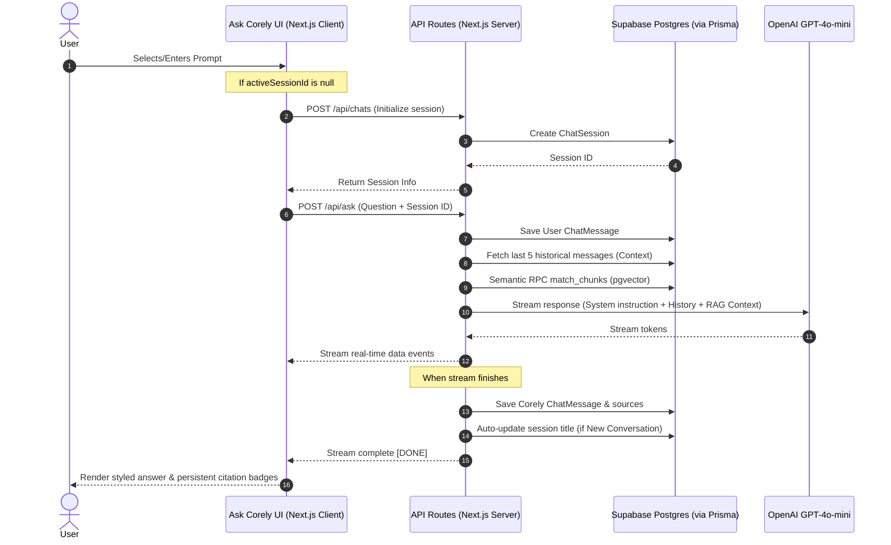

# Feature 2: Stateful Ask Corely AI Q&A Interface & Persistent Session History

This document outlines the architectural changes, database updates, API endpoints, and user interface enhancements implemented to support **Feature 2: Stateful Ask Corely AI Q&A Interface & Persistent Session History**. 

These modifications transform the previously ephemeral Ask Corely interface into a fully state-managed, production-grade enterprise conversation platform backed by a cloud database.

---

## 1. Architectural Highlights

---

## 2. Database Schema (`prisma/schema.prisma`)

Two core relational tables were added and migrated to the PostgreSQL instance on Supabase via Prisma to handle persistent data:

### `ChatSession` Model
Tracks distinct conversation threads linked to a user's `Workspace`.
* **Table**: `chat_sessions`
* **Fields**:
  * `id`: `Uuid` (Primary Key, default `uuid_generate_v4()`)
  * `workspaceId`: `Uuid` (Foreign Key, references `Workspace.id` with cascade deletion)
  * `title`: `String` (Automatically populated with the first 40 characters of the initial query)
  * `createdAt`: `DateTime` (Default `now()`)
  * `updatedAt`: `DateTime` (Automatically managed on updates)

### `ChatMessage` Model
Represents actual conversation rows inside a thread.
* **Table**: `chat_messages`
* **Fields**:
  * `id`: `Uuid` (Primary Key, default `uuid_generate_v4()`)
  * `sessionId`: `Uuid` (Foreign Key, references `ChatSession.id` with cascade deletion)
  * `sender`: `String` (Enum value: `'user'` or `'corely'`)
  * `text`: `String` (Raw content text)
  * `sources`: `Json` (Holds structural citations: `title`, `url`, `type`)
  * `feedback`: `String` (User rating: `'positive'`, `'negative'`, or `null`)
  * `createdAt`: `DateTime` (Default `now()`)

---

## 3. Server-Side API Routing

We designed five highly optimized dynamic Next.js API endpoints to orchestrate conversation operations:

### `GET /api/chats?workspaceId=...`
Lists all active conversation sessions for the active workspace, sorted by `updatedAt` in descending order.

### `POST /api/chats`
Spins up a new empty conversation session with a placeholder title (`"New Conversation"`).

### `GET /api/chats/[sessionId]`
Retrieves a specific chat session alongside all associated `ChatMessage` logs, ordered chronologically.

### `DELETE /api/chats/[sessionId]`
Deletes a conversation session, cascading deletions down to all underlying messages.

### `POST /api/chats/[sessionId]/messages/[messageId]/feedback`
Records thumbs-up/down ratings (`"positive"`, `"negative"`, or `null`) on responses.

### `POST /api/ask` (Upgraded)
Upgraded from stateless RAG queries to dynamic context-aware streaming:
1. Validates and saves the incoming user message to the database.
2. Extracts up to the **last 5 messages** within the current session to append as conversational history context, enabling coherent multi-turn QA dialogues.
3. Retrieves relevant vector knowledge from Supabase pgvector (`match_chunks`).
4. Feeds full prompt (Instructions + History + Context) to GPT-4o-mini.
5. Saves the final assistant answer and retrieved JSON citations on stream completion.
6. Auto-updates the chat session title based on the first question.

---

## 4. Frontend Client Architecture (`app/dashboard/ask-corely`)

The interface was restructured into a highly cohesive, reactive Client Component page layout:

### Main Page Router (`page.tsx`)
Now manages parent React states:
* `activeSessionId` (`string | null`): Tracks the active loaded thread.
* `refreshTrigger` (`number`): Increments dynamically to signal list updates across components.

### Ask Main View (`components/AskMain.tsx`)
* **Dynamic Loading**: Watches `activeSessionId` changes and fetches history. Pairs user questions and assistant answers into a premium single card block.
* **On-the-Fly Creation**: Automatically triggers `POST /api/chats` when the user submits a prompt while `activeSessionId` is null, preventing empty initial page constraints.
* **Interactive Preset Cards**: Presets trigger direct submission on click instead of just populating the text field.
* **Glowing Rating Highlights**: Custom thumbs up/down click actions interact with the feedback API and persist state with beautiful color selections (`#ff6b00` for positive, `#ea3838` for negative).

### Ask Right Sidebar View (`components/AskRightSidebar.tsx`)
* **Session Listing**: Fetches recent threads and highlights the active conversation thread using active styles.
* **Delete Session**: Features a custom hovering trash icon (`Trash2`) on conversation items with an optimistic interface removal.
* **New Conversation CTA**: Added a premium orange glassmorphism `New Conversation` button to easily reset workspace session hooks.

---

## 5. Verification & Stability

* **Type Safety**: Avoids `any` completely, utilizing strictly mapped TS interfaces (`ChatMessage`, `AskMainProps`, etc.).
* **Zero Compilation Issues**: Successfully builds under strict Next.js and ESLint configurations.
* **Relational Integrity**: Integrates clean cascading deletions (`onDelete: Cascade` in Prisma) to ensure no orphaned message records remain on session deletion.
